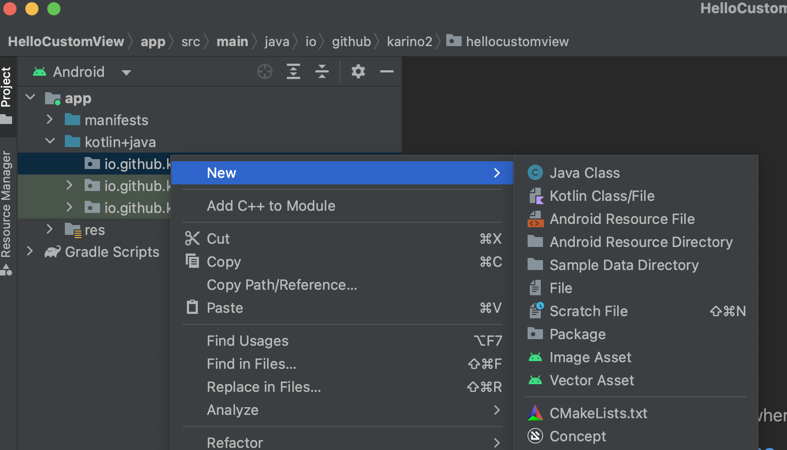
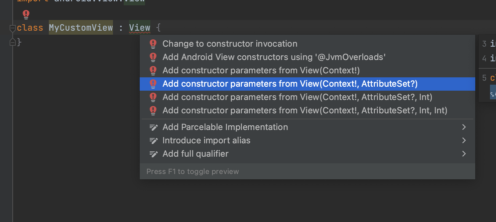
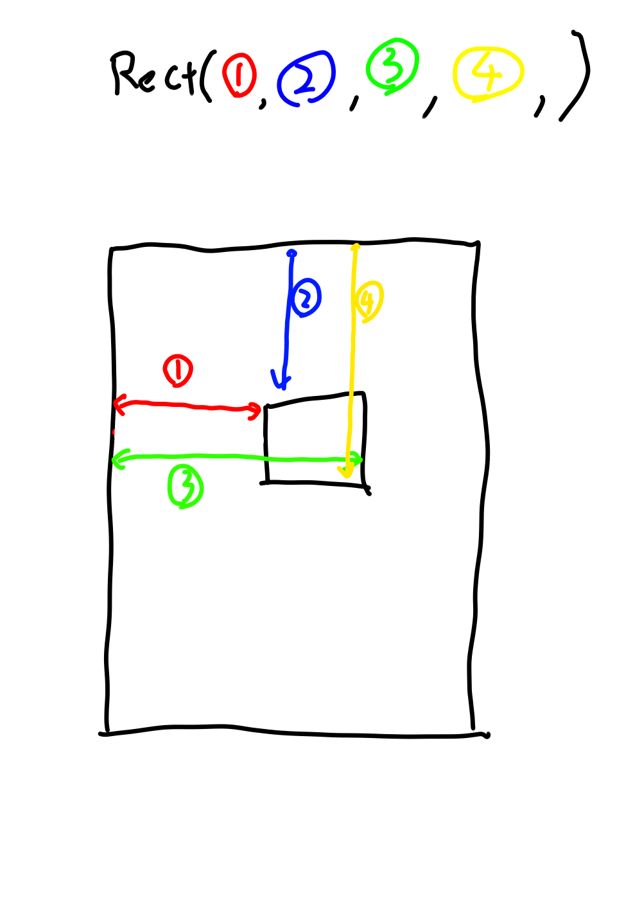

ここでは「はろー、CustomView」とだけ表示するCustomViewを作ってみたいと思います。

## 作業手順

まずは何も考えずに以下の手順で作業をしてみてください。

### 1. HelloCustomViewというプロジェクトをいつも通り作る

いつも通りHelloCustomViewというプロジェクトを作ります。

### 2. MyCustomView.ktというファイルを追加

左側のMainActivityとかが入っているフォルダみたいな奴を右クリックして「New＞Kotlin Class/File」を選び、
出てきたダイアログに、「MyCustomView」と打ってエンター。



そうするとMyCustomView.ktというファイルが作られて開かれるはずです。

### 3. MyCustomView.ktの中を書き換え、コンストラクタを作る

作られた時点では、MyCustomView.ktは以下のような感じの内容のはずです。ただし、packageの所の行は違う内容のはずです。

```kotlin
package io.github.karino2.hellocustomview2

class MyCustomView {
}
```

この、3行目から下を以下に置き換えます。


```kotlin
class MyCustomView : View {
}
```

するとViewの所が赤くなるはずなので、いつものようにカーソルを持っていってAlt+Enterとかします。

すると今度はViewの所が赤い波線に変わるので、ここをAlt+Enterを押すと、なんかずらすら出るので、
この中から`Add constructor parameters from View(Context!, AttributeSet?)` という奴を選びます（スクリーンショット参照）



するとソースコードは以下みたいになるはずです。

```kotlin
import android.content.Context
import android.util.AttributeSet
import android.view.View

class MyCustomView(context: Context?, attrs: AttributeSet?) : View(context, attrs) {
}
```

### 4. onDrawを追加する

上記の所まで行ったら、MyCustomViewにonDrawを定義します。
以下の、「ここ！」と書いてある所に、


```kotlin
class MyCustomView(context: Context?, attrs: AttributeSet?) : View(context, attrs) {
  // ここ！
}
```

onDrawと打つと、一覧が出るので、`onDraw()`的な奴を選びEnterを押します。
出なかったら何か間違ってます。

すると以下みたいになります。

```kotlin
class MyCustomView(context: Context?, attrs: AttributeSet?) : View(context, attrs) {
    override fun onDraw(canvas: Canvas) {
        super.onDraw(canvas)
    }
}
```

### 5. onDrawの中身を赤い四角を書くように書き換える

onDrawの所を、以下のように書き換えます。（`super.onDraw(canvas)`は消す）

```kotlin
    override fun onDraw(canvas: Canvas) {
        val r = Rect()
        val p = Paint()
        canvas.drawRect(r, p)
    }
```

するといつものようにRectとPaintが赤くなるのでAlt+Enterでimportします。

次に`Rect()`を`Rect(10, 10, 20, 10)`に書き換えます。

次にpの後に以下の二行を足します。

```kotlin
        p.color = Color.RED
        p.style = Paint.Style.FILL
```

Colorの所で赤くなるのでまたimportしておいてください。
最終的なonDrawは以下となります。

```kotlin
    override fun onDraw(canvas: Canvas) {
        val r = Rect(10, 10, 200, 200)
        val p = Paint()
        p.color = Color.RED
        p.style = Paint.Style.FILL
        canvas.drawRect(r, p)
    }
```

onDrawの中でAndroidのオブジェクトを作るのはけしからん、みたいな黄色い警告メッセージが出ますが、とりあえず無視します。

### 6. レイアウトのxmlにMyCustomViewを追加

いつものようにactivity_main.xmlを開いて、LinerLayoutにする作業をしてください。するとこのファイルの中身は以下のようになると思います。

```xml
<?xml version="1.0" encoding="utf-8"?>
<LinearLayout xmlns:android="http://schemas.android.com/apk/res/android"
    xmlns:tools="http://schemas.android.com/tools"
    android:layout_width="match_parent"
    android:layout_height="match_parent"
    tools:context=".MainActivity">

    <TextView
        android:layout_width="wrap_content"
        android:layout_height="wrap_content"
        android:text="Hello World!" />

</LinearLayout>
```

このTextViewの所を先程作ったMyCustomViewにします。

TextViewの所を消して、「MyCus」くらいまで打つと、以下みたいに一覧に出ると思うので、MyCustomViewを選びます。


すると以下みたいになるはずです（パッケージ名はそれぞれの人の設定に合わせたものになる）。

```xml
    <io.github.karino2.hellocustomview2.MyCustomView
        android:layout_width="wrap_content"
        android:layout_height="wrap_content"
        android:text="Hello World!" />
```

このうち、textの指定は不要なので消します。
次にlayout_widthとlayout_heightはmatch_parentに変えます。

最終的なレイアウトのxmlは以下のようになります。

```xml
<?xml version="1.0" encoding="utf-8"?>
<LinearLayout xmlns:android="http://schemas.android.com/apk/res/android"
    xmlns:tools="http://schemas.android.com/tools"
    android:layout_width="match_parent"
    android:layout_height="match_parent"
    tools:context=".MainActivity">

    <io.github.karino2.hellocustomview2.MyCustomView
        android:layout_width="match_parent"
        android:layout_height="match_parent" />

</LinearLayout>
```

###　7. 実行してみる

実行してみましょう。すると画面の左上に赤い四角が描かれるはずです。

### 8. 四角の位置や大きさを変えてみよう

onDrawの以下のコードで四角の位置とか大きさを指定しています。

```kotlin
        val r = Rect(10, 10, 200, 200)
```

Rectの4つの引数は順番に

1. 四角の左は一番左から何ピクセルか
2. 四角の上は一番上から何ピクセルか
3. 四角の右は一番左から何ピクセルか
4. 四角の下は一番上から何ピクセルか

を表します。3と4がちょっとわかりにくいので図にしておきます。



つまり、上記のコードは左上から(10px, 10x)の位置に、幅190px、高さ190pxの四角を描く、というような意味になります。
幅と高さが200ではなく190なのに注意してください。ちなみに幅と高さを200pxにしたければ、以下のようになります。

```kotlin
        val r = Rect(10, 10, 210, 210)
```

以上の4つの数字を変える事で四角形の位置と大きさを変えられます。

**課題1: 左から100pxの位置に描いてみよう**

現状は左から10pxに描かれています。
これをもっと右に移動して、100pxの位置から描かれるようにしてみてください。

**課題2: 横長の長方形を描いてみよう**

左から10pxに戻して、今度は横長にしてみましょう。
幅を400px、高さを100pxにしてみてください。

### 9. 四角の色を変えてみよう

色はRectとは別の所で指定しています。

以下の`p.color`の所で指定しています。

```kotlin
        val p = Paint()
        p.color = Color.RED
        p.style = Paint.Style.FILL
```

**課題3: 色を青に変えてみよう**

Color.REDの所をColor.BLUEにして青にしてみよう。

**課題4: 色をARGBで指定してみよう**

ARGBの値で指定する場合は、以下のように`Color.argb()`で指定出来ます。

```kotlin
Color.argb(255, 255, 255, 0)
```

先頭から アルファ、R, G, Bの順番になります。RとGが255なのでこの場合は黄色ですね。ちなみに整数で指定する場合、各成分は0〜255となります。

では課題として、ARGBを(255, 255, 128, 0)で指定してみてください。何色の四角が描かれますか？

## 簡単なコードの解説

さて、ここまでなんとなく言われた通りに作業してみて少しいじってみました。

今回の内容のそれぞれは今後回を重ねるごとに詳細に解説していきますが、
現時点でもいくつか簡単にコードを解説しておきます。

今回の作業で難しい所は、以下の２つだと思います。

1. コンストラクタの所
2. onDrawの所

### コンストラクタの所は丸暗記

コンストラクタの所というのは以下になります。

```kotlin
class MyCustomView(context: Context?, attrs: AttributeSet?) : View(context, attrs)
```

これはとりあえず手順を丸暗記してください。Viewが赤くなった所でAlt+Enterを押してimportすると波線になるのでもう一回Alt+Enterを押し、これを探して選ぶ。
中身は理解する必要はありません。

一応説明をしておくと、ViewのコンストラクタのうちLayoutInflatorから呼ばれるのがこのコンストラクタなのでこのコンストラクタをオーバーライドする必要があります。

### onDrawとは何か（簡単に）

onDrawというのが何なのかは、今後このカスタムビューの入門をやって行く過程でだんだんと分かっていくものなので、現時点ではちゃんとは分からなくてOKです。
ですが、一応簡単に説明しておきます。

onDrawというのは「そのViewが画面に表示される時に呼ばれる関数」です。
何を描くのかはViewのよっていろいろで、これまで使ってきたViewを例に考えるなら

- TextViewならテキストを描く
- Buttonなら四角の中にテキストを描く
- Switchなら横長の楕円とぽっちみたいなのを描く
- ImageViewなら画像を描く

などになっています。

カスタムビューというのはこの「何を描くのか？」というのを、自分の好きなものに変える事に使えます。

多くの場合、カスタムビューを作るというのは、以下の三つの作業が基本になります。

1. コンストラクタやレイアウトなど、お決まりの作業をする
2. onDrawを書く
3. タッチの処理を書く（次回以降にやる）

今回は1と2をやりました。3については次回以降にやります。

### onDrawとCanvas

今回のonDrawは、以下のようなコードでした。

```kotlin
    override fun onDraw(canvas: Canvas) {
        val r = Rect(10, 10, 200, 200)
        val p = Paint()
        p.color = Color.RED
        p.style = Paint.Style.FILL
        canvas.drawRect(r, p)
    }
```

このうち、コードは無視して以下の部分に着目します。

```kotlin
    override fun onDraw(canvas: Canvas) { // ＜ー ここに着目
      // ここは無視
    }
```

抜き出すと以下ですね。

```kotlin
override fun onDraw(canvas: Canvas)
```

このうち、overrideは[ツアー副読本: クラスの継承](inheritance.html)でやったものです。まぁあまり気にしなくても良い。

ここで重要なのはcanvasという奴です。`onDraw(canvas: Canvas)`という所のcanvasという奴。
大文字で始まるCanvasは型です。で、変数名はcanvasになる。

onDrawは、この渡されてくるcanvasというものを使っていろいろ画面に自分の領域を描く、という事をします。

だからonDrawを理解するのは、最終的にはCanvasというものの使い方を理解する、という事になります。
このカスタムビュー編は、9割くらいはこのキャンバスの使い方を見ていく、という内容になります。

なお、今回はCanvasのdrawRectというメソッドを使って四角を描きました。
onDrawの中の以下の部分です。

```kotlin
        canvas.drawRect(r, p)
```

次に、先程無視したonDrawの中のコードを少し詳細に見てみましょう。

### 今回のonDrawを3つの部分に分ける

onDrawの中は以下のようでした。

```kotlin
    override fun onDraw(canvas: Canvas) {
        val r = Rect(10, 10, 200, 200)
        val p = Paint()
        p.color = Color.RED
        p.style = Paint.Style.FILL
        canvas.drawRect(r, p)
    }
```

これは、３つのパートに分けられます。

1. Rectを作る所
2. Paintを作る所
3. canvas.drawRectを呼ぶ所

コメントを入れると以下のようになります。

```kotlin
    override fun onDraw(canvas: Canvas) {
        // 1はここ
        val r = Rect(10, 10, 200, 200)

        // 2はここから
        val p = Paint()
        p.color = Color.RED
        p.style = Paint.Style.FILL
        // ここまで

        // 3はここ
        canvas.drawRect(r, p)
    }
```

2がちょっと良く分からない感じですね。これは段々と分かってくる所です。

今回理解して欲しい事は

- canvasのdrawRectというものを使って四角形が描ける
- canvasのdrawRectはRectとPaintを指定するらしい
- Rectで位置と大きさを指定する
- Paintは色とかなんか良く分からないものを指定している

という感じです。Paintが何なのか、というのはまだ良く分からなくてOKですが、RectとPaintを指定してCanvasのdrawRectを呼んでいる、という概要はつかんでおいてください。