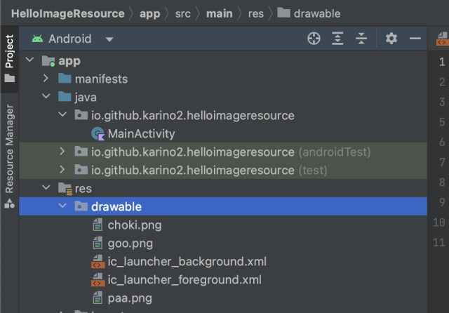
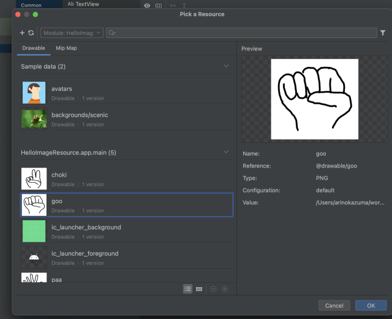

ここではアプリにpngなどの画像を含めて表示する方法を学びます。

ここで使う画像は以下に置いてあります。

[imgs/for_image_resource/](imgs/for_image_resource/)

とりあえずHelloImageResourceというプロジェクトで作業する前提で説明します。LinearLayoutにするまではいつも通り作業しておいてください。

## リソースとは

アプリの中に画像とかテキストとか、何かそういったデータを含める事が出来ます。そうしたデータをリソースと呼びます。
プロジェクトの中の `app/src/main/res` の下に置く事になっています。
お使いのPCのファイルマネージャー（WindowsならExplorer、ChromeBookならFiles）でこのディレクトリを開いてみてください。

これまで見てきた中では、レイアウトリソース（activity_main.xmlなど）がリソースです。

リソースを置くと、`R.xxx.yyyy`の形で参照出来ます。
xxxは種類、yyyyがファイル名（から拡張子をとったもの）になります。

例えばListViewなどでは、`R.layout.list_item` などをlayoutInflatorに渡したりしていたはずです。
これはlayoutリソースのlist_item.xmlを指します。

リソースは普通、アプリを作る時に圧縮したりといった処理が入るので、完全に同じものがアプリに入る訳ではありませんが、
だいたい同じものが入ると思って良いでしょう。

今回は画像リソースをアプリに含めて使う方法を見ていきます。

アイコンなどのリソースは端末の解像度によって大きく異なるので普通は何種類かのリサイズしたものを含めて、ちょうど近いサイズを拡大縮小して使う仕組みがあり、
mipmap-hdpi, mipmap-mdpi, mipmap-xhdpiなどのフォルダがそれにあたります。

今回はそうした仕組みは使わずに同じサイズの画像をどのデバイスでも使うケースの使い方を見てみます。

## 画像リソースを追加する手順

まずお使いのPCのファイルマネージャーで `app/src/main/res` ディレクトリを開きます。
その中にdrawableというディレクトリがあると思うので、そこに含めたい画像ファイル、とりあえず[imgs/for_image_resource/](imgs/for_image_resource/)にある、goo.png, choki.png, paa.pngをダウンロードしてここに置きます。

（以下はMacでの画面なのでWindowsやChromeBookでは少し違うと思います）


次にAndroid Studioで、resを開いて中のdrawableの中に、今置いたファイルがある事を確認します。



これでビルドすれば、アプリに画像リソースを含める事が出来ます。

このdrawableという所が、どのデバイスでも同じ画像を使う類のリソースを置く場所になります。

## ImageViewで画像リソースを表示

次にImageViewをレイアウトに置きます。
すると突然こんなダイアログが出てくると思うので、goo.pngを選んでOKを押してください。



idは一応これまで通りimageView1に変えておきましょう。

これで実行をするとグーが表示されるようになりました。

## ランダムでグー、チョキ、パーを表示する

ボタンを置いて、これが押されたらランダムに表示される画像を変えてみましょう。
「ぽん」というボタンにしましょう。

### プログラムから画像を表示する

ImageViewのsetImageResourceというのを使います。
画像リソースをプログラムから参照するには、`R.drawable.goo` などとします。

具体的には以下のような感じになります。

```kotlin
findViewById<ImageView>(R.id.imageView1).setImageResource(R.drawable.goo)
```

### ランダムはkotlinではRandom.nextInt

ランダムは、kotlinでは`Random.nextInt(はじまり, 終わり)`で得られます。終わりは含みません。

AndroidStudioでRandom、と書いて赤くなったらいつものようにAlt+Enterを押してimpoortを追加します。
場合によっては二種類選択肢が出るかもしれませんが、その場合はkotlin.randomの方を選びます（java.utilの方ではありません）。

以下のように使います。


import kotlin.random.*

fun main() {
  for(i in 0..20) {
    val v = Random.nextInt(0, 6)
    println(v)
  }
}



これを使って0, 1, 2の三種類の乱数を返すようにして、0ならグー、1ならチョキ、2ならパーを表示しましょう。


