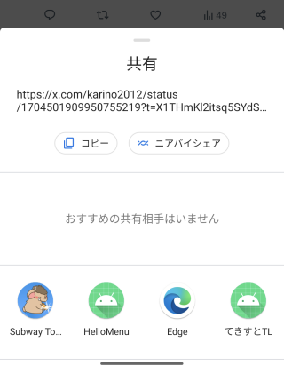

ここではintentというものを送ったり受け取ったりする事を学びます。

## intentを送ってみる

[複数アクティビティ](two_activities.md)でintentというものが出てきました。その時は指定したActivityに行くのに使うというものでした。

ですがintentはもうちょっとゆるく、「こんな条件を満たすActivityに行きたい」という指定が出来ます。
言葉よりも試す方が早いので、以下のコードを試してみてください。

ボタンを5個くらい作って、以下のようなコードを試してみてください。

```kotlin
findViewById<Button>(R.id.button1).setOnClickListener {
  val intent = Intent(Intent.ACTION_SEND)
  intent.type = "text/plain"
  intent.putExtra(Intent.EXTRA_TEXT, "ぼえ〜 https://karino2.github.io/kotlin-lesson/")
  startActivity(intent)
}
```

以下、インテントの作り方だけいろいろ書きますので、それをsetOnClickListenerの中で作ってstartActivityに渡してください。

### ブラウザ

```kotlin
val intent = Intent(Intent.ACTION_VIEW, Uri.parse("https://karino2.github.io/kotlin-lesson/"))
```

### カメラ

なお、撮影しても何も起こりません。

```kotlin
val intent = Intent(MediaStore.ACTION_IMAGE_CAPTURE)
startActivity(intent)
```

### スケジュール

```kotlin
val intent = Intent(Intent.ACTION_INSERT)
intent.data = CalendarContract.Events.CONTENT_URI
intent.putExtra(CalendarContract.Events.TITLE, "あおぞら教室！")
intent.putExtra(CalendarContract.Events.EVENT_LOCATION, "逗子コミュニティスペース")
intent.putExtra(CalendarContract.EXTRA_EVENT_BEGIN_TIME, Date(2023, 9, 22, 17, 0).time)
intent.putExtra(CalendarContract.EXTRA_EVENT_END_TIME, Date(2023, 9, 22, 21, 0).time)
```

### 画像取得

ただし取得しても何も起こりません。

```kotlin
val intent = Intent(Intent.ACTION_PICK)
intent.type = "image/*"
```

### タイマー

AndroidManifests.xmlに、 `<uses-permission android:name="com.android.alarm.permission.SET_ALARM" />`を指定すると以下も出来ます。

```kotlin
val intent = Intent(AlarmClock.ACTION_SET_TIMER)
intent.putExtra(AlarmClock.EXTRA_MESSAGE, "カップラーメン")
intent.putExtra(AlarmClock.EXTRA_LENGTH, 3*60)
intent.putExtra(AlarmClock.EXTRA_SKIP_UI, true)
```

タイマーの他に、アラームとかも出来ます。

### intentを送るのは見様見真似で適当にやるしか無い

どういうintentを送ると何が起こるのかは、一応ドキュメントも無くは無い。

[一般的なインテント - Android Developers](https://developer.android.com/guide/components/intents-common?hl=ja)

けれどここに無いインテントもあったり、説明の通りに動かなかったりするのもあるので、
そこまで頼りになる感じでもなかったりします。

結局は適当にググって試してみるとか、他人がどういうインテントを送っているかをインテントを調べるアプリを入れて調べるとかして、
泥臭いやり方でやっているのが実情です。

## intentを受け取る

intentは送るのは簡単ですが、受け取るのはちょっと大変です。

とりあえず良く使うのはACTION_SENDを受け取るくらいだと思うので、その方法だけ書いておきます。

intentを受け取るには以下の手順となります。

1. AndroidManifests.xmlにintent filterというのを書く
2. onCreateで受け取るコードを書く

順番に見ていきましょう。

### AndroidManifests.xmlにintent filterを書く

最初にプロジェクトを作った状態でAndroidManifests.xmlを開くと、以下のような所があるはずです。

```xml
        <activity
            android:name=".MainActivity"
            android:exported="true">
            <intent-filter>
                <action android:name="android.intent.action.MAIN" />

                <category android:name="android.intent.category.LAUNCHER" />
            </intent-filter>
        </activity>
```


このintent-filterというので、このActivityの受け取るインテントが決まります。
`action.MAIN` と `category.LAUNCHER` というのは、ホーム画面のアプリ一覧に並んで、アプリ一覧がタップされるとやってくるintentです。

つまりホーム画面から起動したい場合はこのintent-filterを足す事になります。
例えば二つめのActivityを作って、その中にこのintent-filterを足すと、ホーム画面から二つ目のActivityを直接起動出来るようになります。
ホーム画面からはまるで二つのアプリがあるように見えます。

これは後で試してみる事にして、ここでは新しいintent-filterとしてACTION_SENDを受け取るintent-filterを足します。

```xml
<intent-filter>
  <action android:name="android.intent.action.SEND"/>
  <category android:name="android.intent.category.DEFAULT"/>
  <data android:mimeType="text/*"/> 
</intent-filter>
```

つまり、activity全体としてはこうします。

```xml
        <activity
            android:name=".MainActivity"
            android:exported="true">
            <intent-filter>
                <action android:name="android.intent.action.MAIN" />

                <category android:name="android.intent.category.LAUNCHER" />
            </intent-filter>
            <intent-filter>
              <action android:name="android.intent.action.SEND"/>
              <category android:name="android.intent.category.DEFAULT"/>
              <data android:mimeType="text/*"/> 
            </intent-filter>
        </activity>
```


これでtextのSENDインテントに反応するようになります。

例えばtwitterアプリなどで、共有をすると、このアプリが選べるようになります。
一応手順のスクショを貼っておきます。

ツイートの共有のアイコンを選んで、


そこからまたShare viaというのを選んで、


最後に出たこの画面を下にスワイプすると、



このアプリの名前が出ているはずです。

### onCreateで受け取るコードを書く

onCreateでintent変数がnullでは無くて、intent.typeがnullでなかったら、先頭が"text/"で始まっているかをチェックして、
始まっていたら待っているインテントなのでテキストを取得してTextViewに表示します。

```kotlin
  if (intent != null) {
      val type = intent.type
      if(type != null && type.startsWith("text/")) {
          findViewById<TextView>(R.id.label1).text = intent.getStringExtra(Intent.EXTRA_TEXT)
      }
  }
```

これでSNSなどのアプリから共有、で共有出来るようになります。