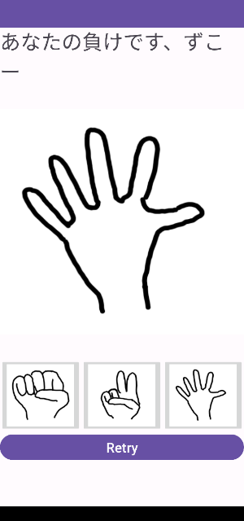

前の[画像リソースと表示](image_resource.md)でじゃんけんゲームでも作ろうかと思ったら、意外と難しかったので独立したページにしました。

簡単なじゃんけんゲームを作ってみます。だいたいこんな感じの奴です。

## プロジェクトと画像リソース

JankenGameという名前のプロジェクトにしましょう。

以下の画像をリソースに加えます。

[imgs/for_image_resource/](https://github.com/karino2/kotlin-lesson/tree/master/imgs/for_image_resources)

上に表示するのがgoo.png、下のボタンに表示するのをgoo_small.pngとしています。
両方リソースに加えましょう。

## レイアウト

上から、

- TextView
- ImageView
- LinearLayout(horizontal)
  - ImageButton
  - ImageButton
  - ImageButton
- Button（リトライ）

という感じにします。ImageButtonは今回初登場ですね。Buttonsの中に入っています。

ImageButtonはlayout_weightを全て1にしましょう。layout_weightを指定する時はlayout_widthは無視されますが、
一応0dpにしておくのがお作法という事になっています。

### ImageButtonとscaleType

ImageButtonは画像を使ったボタンです。コード側ではsetOnClickListenerとかで処理出来ます。

ImageButtonはsrcに画像を指定します。こういうのはUIエディタの右側のずらずらattributeが並んでる奴で指定すると簡単でしょう。goo_small、choki_small、paa_smallを指定します。

こうすると、幅はLinearLayoutが計算するけれど、この幅が画像と違うので、ちょうど良い感じに入ってくれません。
そこで、scaleTypeというのを指定して良い感じに拡大縮小するようにします。

まず、adjustViewBoundsというのをtrueにします。これはscaleTypeとセットで使うものなので、scaleTypeを使う時には必ずtrueにするようにしましょう。

scaleTypeも右側の奴で選ぶ方がいいと思います。選べるものの一番が出ると思いますが、scaleXYかscaleStartが良いでしょう。
他のも試してみても構いません。

## まずはグーのImageButtonだけ処理を書いてみる

グー、チョキ、パーのボタンの処理はほぼ同じになります。結構長くなるので、まずは一つだけ処理を書いてみます。

- 乱数で0〜2のどれかを引く
  - 0をグー、1をチョキ、2をパーとする
- この値に応じてImageViewのsetImageResourceを呼び出す
- TextViewに勝ちか負けかアイコかを表示する

リトライボタンがずっと押せるままなのはおかしいですが、その辺はあとで直しましょう。

### とりあえずリトライButtonはTextViewを変えるだけ

リトライButtonが押されたら、TextViewを「じゃんけん」に変えましょう。とりあえずはこれだけでいいです。

### 関数を使ってコードを綺麗にしよう

チョキやパーの処理を増やす前に、一旦コードを整理します。
同じようなコードがたくさんある場合はいろいろ関数を作ってキレイにしていきます。

チョキでも同じ処理になると思う所も関数にしましょう。

例えば乱数の値に応じてImageViewにsetImageResourceする所はチョキでも同じになるはずです。

また、勝ち、負け、あいこの処理もチョキでも同じはずです。

このように、同じになる処理は関数にして、それをグーでもチョキでも呼ぶようにします。

### チョキ、パーの処理も書く

整理したあとにチョキを書きます。書いてみたらもっと共通の関数を作れるとかこれじゃダメだ、とか気づく事もあると思うので色々直します。
グーとチョキのコードが良い感じになったらパーを足します。

## リトライとImageButtonのenabledを適切に変えよう

ゲーム中はリトライのenabledをfalseに。
ゲーム終了時はImageButtonのenabledをfalseにしよう（3つとも）。

そしてそれぞれ必要な所でenabledをtrueにしよう。

ImageButtonのenabledなどは三回やる事になるので、ぐー、ちょき、ぱーの頭文字でGCPとすると、`setEnableGCP(isEnalbe: Boolean)` みたいな関数を作るといいかもしれない。