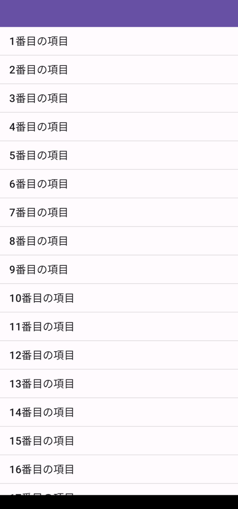
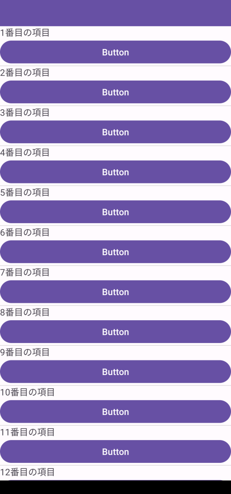

Android初心者の墓場、またはAndroid開発者かそうでないかを分ける試金石、ListViewに挑みます。
二回に分けて作業していきます。前篇のここでは、リストのデータを表示する事にチャレンジ。


## ListView概要

さっぱり分からん、と言われたので、登場人物を説明する程度の、概要動画を作った。

<iframe width="560" height="315" src="https://www.youtube.com/embed/Br83g3isjBU" title="YouTube video player" frameborder="0" allow="accelerometer; autoplay; clipboard-write; encrypted-media; gyroscope; picture-in-picture; web-share" allowfullscreen></iframe>

## 第一段階： 素のsimple_list_item_1を使って表示する

まずはアイテムのカスタマイズを一切行わない表示から。



### メンバ変数の雑な説明と表示するデータ

最初、新規のプロジェクトを作ると以下のようなコードがあります。

```kotlin
    override fun onCreate(savedInstanceState: Bundle?) {
        super.onCreate(savedInstanceState)
        setContentView(R.layout.activity_main)
    }
```

このonCreateの外に定義する変数をメンバ変数といいます。（メンバ変数が何かはクラスの話が必要になってくるので、現時点ではこの説明で納得してください）

例えば、以下のlistDataはメンバ変数です。

```kotlin
    val listData = listOf("１つ目のアイテム", "２つ目のアイテム", "３つ目のアイテム", "４つ目のアイテム", "５つ目のアイテム")

    override fun onCreate(savedInstanceState: Bundle?) {
        super.onCreate(savedInstanceState)
        setContentView(R.layout.activity_main)
    }
```

以後、「メンバ変数としてXXを定義してください」と言ったら、このonCreateの外に変数XXを定義する、と理解してください。

ここから先はこのlistDataを表示するのを目指します。

### ListViewをレイアウトに置く

Layout側にListViewを置き、idをlistViewにする

画面いっぱいになるようにする。

### メンバ変数にArrayAdapterをlazyで作る

adapterをメンバ変数として定義します。ただし、ちょっと特殊な事があるので、以下のコードをそのまま写してください。(場所はメンバ変数のところ)

```kotlin
val adapter by lazy { ArrayAdapter<String>(this, android.R.layout.simple_list_item_1, listData) }
```

by lazyじゃないとこのタイミングではまだLayoutInflaterは使えん（getSystemServiceをonCreateの前に呼ぶな）、と言われて落ちる。

[githubのAOSPミラーのsimple_list_item_1.xml](https://github.com/aosp-mirror/platform_frameworks_base/blob/master/core/res/res/layout/simple_list_item_1.xml)

### showMessageを作る

以下はListViewとは関係ないのですが、今後もちょくちょく使うのでshowMessageを作っておきます。
JS入門のMessageBox.showと似たものです。

関数の説明をするところまで来たら詳細を説明するので、今は下のコードをコピペしておいてください。
ただし、onCreateの外にコピペします（メンバ変数と同じあたり）

```kotlin
fun showMessage(msg: String) { Toast.makeText(this, msg, Toast.LENGTH_LONG).show() }
```

### onCreateでListViewにadapterをセットしてitemのクリックリスナーを作る

ListViewをfindVewByIdで取り出して、adapterとsetOnItemClickListenerをセットします。

```kotlin
findViewById<ListView>(R.id.listView).adapter = adapter
```

### onCreateでListViewにitemのクリックリスナーを作る

```kotlin
findViewById<ListView>(R.id.listView).setOnItemClickListener { parent, view, position, id ->
    val selectedText = view.findViewById<TextView>(android.R.id.text1).text.toString()
    showMessage("${selectedText}が選ばれました")
}
```

### 課題： listDataをMutableListにして100件くらい何か文字列を入れる

ListViewはスクロールする方が何なのか分かりやすいので、

1. listDataをMutableListにする
2. onCreateの中で100件くらい何か詰める

という事をやりましょう。

## 第二段階： 自分のレイアウトを定義する

自分のレイアウトを差し替える方法を学ぶ。




### 新しいレイアウトを定義して、以下の要件を満たすようにする

- ファイル名はlist_item.xml
- トップはLinearLayout
- TextViewを置く、idはitemLabelとする
- Buttonを置く、idはitemButtonとする、textは"ボタン"とかかな（なんでもいい）


### ArrayAdapterのgetViewを差し替える

```kotlin
val adapter by lazy { object: ArrayAdapter<String>(this, R.layout.list_item, listData) {
            override fun getView(position: Int, convertView: View?, parent: ViewGroup): View {
                val view = if(convertView == null) layoutInflater.inflate(R.layout.list_item, null) else convertView

                val data = listData[position]
                view.findViewById<TextView>(R.id.itemLabel).text = data
                return view
            }
        }
    }
```

なお、getViewをoverrideするので本当はコンストラクタのR.layout.list_itemはなんでも良い（使わないので）。

### setOnClickListenerで自分のTextViewを呼ぶように変える

```kotlin
findViewById<ListView>(R.id.listView).setOnItemClickListener { parent, view, position, id ->
    val selectedText = view.findViewById<TextView>(R.id.itemLabel).text.toString()
    showMessage("${selectedText}が選ばれました")
}
```

### ボタンが押された時の処理も書いてみる

getViewの中で、以下みたいな感じで何か書く（showMessageでアイテムの内容を使った何かを表示するのがいいかもしれない）

```
    view.findViewById<Button>(R.id.itemButton).setOnClickListener = ...
```

