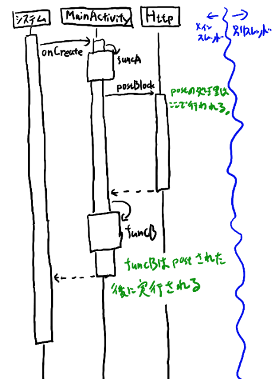
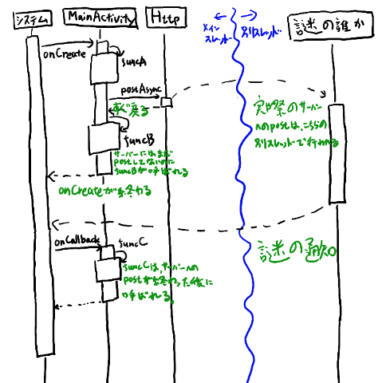

## はじめに

このkotlin lessonではhttpにはfuelを使ってもらっている。
だからコルーチンというかawaitResponseResultとかを使ってもらっている。

で、コルーチンの解説なんて死ぬほどあるだろうから適当にググって適当に書いてください、と言った所、みななんか全然分かってない感じのコードを書いてくる。

何故だ？解説とかあるだろ？と思ってググると、「確かにこれじゃ入門者は使えないな…」というのばかり。
という事で、あまり分かってない人がとりあえず使うのに必要となる事だけを解説してみます。

hello worldとかでは無くて、そういうのを動かした後に読む文書です。


### この文書を書こうと思ったきっかけ

こんなコードが来ました（多少解説の為に変更しています）。

詳細はいいとして、putContentInnnerはsuspend関数で中にawaitResponseResultなどを呼んでいる。
そしてそれをputContentという関数でラップしていて、この中でlaunchが呼ばれている。

```
class ContentSender {
    // ... 中略 ...

    private suspend fun putContentInner(apiUrl: String, branchName: String, fname: String,
     base64Content: String, accessToken:String) : Response {
        val (_, _, result) = "$apiUrl?ref=$branchName".httpGet()
            .header("Authorization" to "token ${accessToken}")
            .awaitResponseResult(Content.Deserializer(), Dispatchers.IO)

        val contParam = arrayListOfContentParameter(branchName, fname, base64Content)

        result.fold(
            { cont -> contParam.add("sha" to cont.sha) },
            { _ /* err */ -> {} }
        )


        val json = jsonBuilder {
            val obj = beginObject()
            contParam.map { (k, v) -> obj.name(k).value(v) }
        }

        val (_, resp, _) = apiUrl.httpPut()
            .body(json)
            .header("Authorization" to "token ${accessToken}")
            .header("Content-Type" to "application/json")
            .awaitStringResponseResult(scope = Dispatchers.IO)
        return resp
    }

    fun putContent(apiUrl: String, branchName: String, fname: String, base64Content: String, accessToken: String) {
        job = Job()
        launch {
            val resp = putContentInner(apiUrl, branchName, fname, base64Content, accessToken)

            val sendCode: Int = when(resp.statusCode) {
                200, 201 -> 2
                else -> 1
            }
            prefs.edit().putInt("success_post",sendCode).commit()
        }
    }
}
```

そしてこれをActivityから呼んでいた。

```
class MainActivity : AppCompatActivity() , CoroutineScope {
    // ... 中略 ...
    fun onClick() {
        val base64Content = readBase64(fileName)
        val sender = ContentSender(this)
        sender.putContent(apiUrl, "master", fileName, base64Content, accessToken)
        finish()
    }
```

これではputContentが全てを送信する前にfinishが呼ばれてしまうのでまずい。
これがなぜ悪いのか、どう直すべきなのか、を理解する程度の説明をするのがこの文書の目的です。

### この文書で解説する事、しない事

[公式の入門](https://kotlinlang.org/docs/reference/coroutines/coroutines-guide.html)に書いてあるような事は説明しません。
全体像なども解説はしません。
内部の仕組みも解説しません。

その代わり、呼び出しのフローがどうなって何がどこのスレッドで実行されるか、という事を理解して、
上記のコードがなぜ悪いのか、どう直すべきなのかを理解出来る程度の到達点を目指します。
良くある普通のケースでどうなるのか、を話すので、「dispatcherとか使えばそうじゃないケースも作れるよ」とかそういうのは書きません。

あくまで最初に見様見真似で使い始める時に必要な最低限の事だけ書きます。
ある程度使って慣れてきたら、ちゃんと内部の仕組みを理解するドキュメントに進んでください。

次のステップに進むには、[菊田さんが挙げている文書](https://yoheikikuta.github.io/study_kotlin_coroutine/) でだいたいいいと思います。

解説する事をまとめると以下になります。

- なんとなくlaunchでくくればいいや、という理解から卒業する
- suspend関数を利用者の視点で理解する（仕組みは知らん）
- suspend関数を自分で書いて公開出来るようにする（ただし中では他のsuspend関数呼ぶだけ）
- 呼び出し時にどこがどのスレッドで動くかを理解する


# 非同期なAPIとは何か

suspend関数とは、「非同期のAPIをラップしたもの」です。
そこでsuspend関数とは何かを知る為には、
「非同期のAPIとは何か？」という事を理解するのが前提となります。

そこで非同期のAPIについて簡単に説明します。

## 非同期なAPIの具体例

例として、Httpというクラスがあって、これにpostAsyncというメソッドとpostBlockというメソッドがあるとします。
postAsyncが非同期にHTTPのpostを行うAPIで、postBlockが非同期でない、同期のブロッキングする形のAPIとします。

### 非同期でない場合(postBlockの場合)のシーケンス

まずは非同期じゃない、ブロッキングのAPIの場合のシーケンスを考えます。以下のようなコードです。
(疑似コードなので詳細はつっこまないでください)。

```
class MainActivity {
    fun onCreate() {
        funcA()
        Http.postBlock(url, some_content)
        funcB()
    }
}
```

これのシーケンスは以下のようになります。



ここで、postBlockはonCreateの中でその実行を最後まで終える（シーケンスの中でonCreateの箱の中に全部入っている）というのが同期APIの基本です。

funcBを呼ぶ時点では既にサーバーへのポストが終わっている、というのが同期APIの特徴です。


### 非同期なAPIでのシーケンス

上記のコードを少し変えて、postAsyncを使うように変えてみましょう。(疑似コードなので詳細はつっこまないで！)

```
class MainActivity {
    fun onCreate() {
        funcA()
        Http.postAsync(url, some_content, onCallback)
        funcB()
    }

    fun onCallback() {
        funcC()        
    }
}
```

この場合のシーケンス図は以下のようになります。



ごちゃごちゃしてますね。いくつか重要な所があるので、以下の説明と突き合わせてみてみてください。

まず、postAsyncは呼ぶと、すぐ終わって帰ってくる。これは一瞬です。
そして実際のサーバーへのpostはここでは行われない。謎の誰かが「別スレッド」で行います。

funcBの実行は、実際にサーバーへのpostが行われるよりも前に実行されます。
普通はonCreate自身もサーバーへのpostが行われるよりも前に終わってしまいます。

そして別スレッドで実際にサーバーへのpostが終わると、謎のメカニズムでシステムに通知がいって、
システムからonCallbackが呼ばれます。
このonCallbackは「主スレッド」で呼ばれるというのは重要なポイントですが、
funcBと違ってサーバーへの実際のpostが終わった後である事が保証されているタイミングで呼ばれる所が違います。

以上の比較を元に、非同期APIの基本的な前提を次にしていきたいと思います。

## 非同期APIと実行されるスレッド

非同期APIを理解する為には、コードのどこの部分がどこのスレッドで実行されるのか、という呼び出しシーケンスをちゃんと理解するのが大切です。
ここで細かい所を曖昧にしないでちゃんと厳密に考えるのが非同期APIやsuspend関数を理解するコツです。

ではその辺の説明をしていきましょう。

### 非同期なAPIには別のスレッドが前提とされている

非同期のAPIというのは、暗黙のうちに「別のスレッド」が前提とされています。
そこでこの記事でも、この呼び出しの元である「主スレッド」と、
非同期APIが実際の仕事を行う「別のスレッド」の二つを考えていきます。

なお、初心者のうちはこの二つだけ考えれば十分です。
イキリついったらーが一般的に語りたがる事がありますが、うるせー、とか言っておきましょう。

### postAsyncは「主スレッド」で実行される（そしてすぐ返ってくる）

ちょっと細かい事になるのですがはっきりさせておきたい事として、postAsyncという呼び出し自体は「主スレッド」で行われます。
そしてすぐ戻ってきます。
あくまで「主スレッド」で呼び出して戻ってくる、というのは大切なポイントです。

### コールバックはどこのスレッドで呼ばれるか

postAsyncにはコールバックを渡すのが良くある形式です。
コールバックはどこのスレッドで呼ばれるかというと、これも「主スレッド」です。
ただし、先ほどのシーケンス図からも分かるように、現在のメソッドの中ではなくて、あとでシステムから呼ばれます。
この場では呼ばれない、というのも重要なポイントです。

ただし、このコールバックもあくまで「主スレッド」で呼ばれます。

### では「別スレッド」で実行されるのはどこなのか？

という事でここまで、コード上に出てくるものは全部主スレッドで実行されます。
では「別スレッド」で実行されるのはコードのどこなのか？というと、「コードの上には」どこにもありません。

これは重要なポイントです。書かれているコードは、全部「主スレッド」で実行されます。

では、「別スレッド」で実行されるのは何か？というと、「書かれてない何か」が実行されるのです。
非同期APIを考える上で大切なのは、「書かれてない何かの処理がある」という事、
そしてそれが「書かれてない暗黙の別スレッドで実行される」という事を意識する事です。

書かれてない物がどこで実行されるか、という事をイメージするのが非同期APIのコード、
ひいてはsuspend関数のコードの実行を理解する秘訣です。

書かれてない何かの処理が、別のスレッドで実行されて、そこでpostの処理が行われます。
そして終わったら初めて「書かれている」コードである、コールバックに「主スレッドで」戻ってくるのです。

### 非同期APIまとめ

- 非同期APIには、暗黙の別スレッドがあってそこで処理が実行される
- 非同期APIの暗黙の別スレッドでは、書かれてない処理が実行される
- postAsyncの呼び出しもコールバックの実行もあくまで「主スレッド」で行われる

このようなイメージを持っておけば初心者は十分です。

# suspend関数とは

次にようやく本題のsuspend関数の説明に入ります。
suspend関数は

- 非同期APIをラップしたものである
- suspend関数のあるところでコードがブロックに分かれてキューに入れられる
- 書かれているコードは全て主スレッドで実行される
謎
という話となります。

## suspend関数は非同期なAPIをラップしたものである

### 関数の内部の実行スレッド

### 別のスレッド

## コードの分割とキュー

## launchで何が起こるか

## launchの処理が終わったあとに何かをやりたい！という場合

