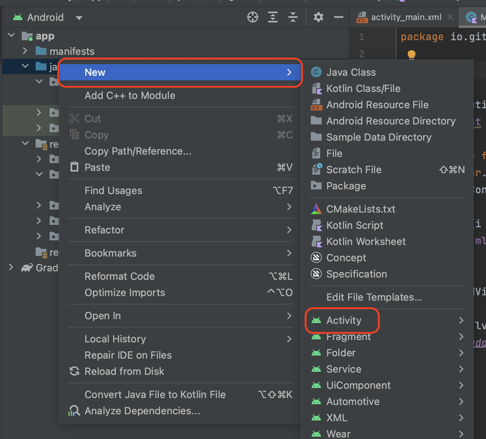

ここではActivityというのものと、それを行ったり来たりする方法を学びます。

## てきすとでっきのようなアプリを作りたい

まずは用途から。てきすとでっきのようなアプリを作りたい。

[てきすとでっき - Google Play のアプリ](https://play.google.com/store/apps/details?id=io.github.karino2.textdeck&hl=ja)

ファイル選択の所はしばらくやらない予定なので、それ以外で現時点で作れ無さそうな部分はどこでしょうか？

1. Newやアイテムをクリックすると別の画面に行く奴
2. 上の所のメニュー

この二つくらいでしょう。

そこでまずは1の、複数画面を行ったり来たりする所をやります。
この画面をActivityと呼びます。

## 二つのアクティビティを行ったり来たりしてみる

まずは二つのActivityを行ったり来たりするアプリ、
HelloTwoActivityを作ってみましょう。

なお、アクティビティとかインテントについて、簡単な解説動画を作りました。

<iframe width="560" height="315" src="https://www.youtube.com/embed/UP48_hd-Cpo?si=RT7shaNDSDIv4nKS" title="YouTube video player" frameborder="0" allow="accelerometer; autoplay; clipboard-write; encrypted-media; gyroscope; picture-in-picture; web-share" allowfullscreen></iframe>

### いつも通り1つめのActivityを作る

いつも通りNew ProjectでHelloTwoActivityというのを作り、
いつもと同じ感じでEditTextとButtonを画面に置きます。idは適当に決めてください。TextViewじゃなくてEditTextなのに注意。

とりあえずボタンが押されたらEditTextの内容をshowMessageするようにしてみましょう。

### 2つめのActivityを作る

左側のappとかjavaを右クリックしてNewから、真ん中よりちょい下のActivityを選び、



その中の「Empty Views Activity」を選びます。（なんか聞いた事ある名前ですね）

そしてActivity Nameは「SecondActivity」にしてください。

するとレイアウトに、これまでのactivity_main.xmlの隣に、activity_second.xmlというものができるはずです。
このactivity_second.xmlもいつものようにLinearLayoutにした後に、以下のような感じにします。

- LienarLayout vertical
  - TextView
  - LinearLayout horizontal
    - 「キャンセル」ボタン
    - 「修飾」ボタン


**ボタンの指示**  
そろそろボタンは「textをキャンセルに、idをbuttonCancelにしたボタン」と言わずに、「キャンセル」のボタン、とだけ言う事にします。

「キャンセル」のボタン、とったらtextに「キャンセル」を、idにはそれと分かるもの、例えばこの場合ならbuttonCancelなどをつけてください。

「修飾」のボタン、といったら、textに「修飾」を、idにはbuttonModifyとかがいいと思いますが、英語が難しいようならローマ字でbuttonSyuusyokuとかでもいいです。



### MainActivityからSecondActivityに移動する

１つ目のActivityのshowMessageしていた所を以下のように変更する。

```kotlin
  val intent = Intent(this, SecondActivity::class.java)
  startActivity(intent)
```

新しいActivityを開始するのは`startAcitivity`で行いますが、このstartActivityに、「どんなActivityを始めたいか？」を指示するものをインテント、といいます。
新しいActivityの始め方は、基本的には以下の2ステップになります。

1. Intentを作る
2. 作ったインテントでstartActivityする

Intentの作り方は、とりあえずおまじないのthisと、行き先を渡して作ります。
行き先は `SecondActivity::class.java` という変な表記の仕方で、これは覚えるしかありません。

ただSecondActivityは２つ目のActivityとしてさきほど作ったActivityの名前な事は分かるでしょう。

とにかく、以下でintentが出来て、

```kotlin
  val intent = Intent(this, SecondActivity::class.java)
```

このintentをstartActivityに渡す事で、新しいActivityを立ち上げる事が出来ます。

これでボタンを押すと２つ目のActivityに移動できるようになりました。
また、戻るのジェスチャー（古いAndroidだと戻るボタン）で前のActivityに戻る事もできるはずです。

### SecondActivityから元のアクティビティに戻る

前の画面に戻るには、今のアクティビティを終了させる必要があります。

とりあえず何もせずに終了するなら`finish()`を呼びます。

SecondActivityのキャンセルボタンが押されたら`finish()`を呼んでみましょう。
これでキャンセルボタンを押したら戻れるようになったと思います。

## 2つのアクティビティの間にデータをやりとりしてみる

これまではActivityを立ち上げて戻る、というだけですが、
「てきすとでっき」などのようなアプリは、
選んだアイテムを次のActivityに渡して、そこで変更して戻ってきてデータを更新する、という事が必要になります。

このように二つのActivityの間でデータをやりとりする方法を以下で見ていきます。

Intentは辞書のようにデータを追加していけて、それを使ってデータをやりとりします。

### データを送る

Intentを作るところで、intentにputExtraとしてデータを追加して送ります。

```kotlin
val str = findViewById<EditText>(R.id.edit1).text.toString()

val intent = Intent(this, SecondActivity::class.java)
intent.putExtra("TEXT_DATA", str)
``` 

とかします。
putExtraの１つ目の引数はキー、２つ目の引数が値です。
このキーを使って取り出す側では値を取り出します。

取り出す側、つまりSecondActivity側では、
onCreateで、以下みたいな事をする

```kotlin
if (intent != null) {
  val str = intent.getStringExtra("TEXT_DATA")
  findViewById<TextView>(R.id.label1).text = str
}
```

intentというのはメンバ変数としてシステムが定義しているもので、onCreateの中で使う事ができるものです。
intent越しに作られている時はこれがnull以外の値になり、intent越し以外の手段で作られているとnullになります（後者については実践編の後半でActivityのライフサイクルの所で解説します）。

とりあえずこうやるものだ、と繰り返し作って覚えてしまうのがいいでしょう。

### データを送り戻す前提の立ち上げ方

データを送り戻すには、送り戻すだけではなくて、立ち上げる側も「値を返してもらうActivityを立ち上げます」とシステムに教えてやらないといけない仕組みになっています。
具体的には`startActivity`ではなく、`startActivityForResult`というものを使う事でこれを行います。

startActivityForResultは１つ目の引数にintent、２つ目の引数に数字のIDを指定します。
これは幾つでも良いのですが、後で受け取る時にその数字かどうかで自分の待っているActivityかをチェックするので、分かる数字にします。
ここではとりあえず`123`にしましょう。（普通は1とか2とか連番にしていく）

すると、`startActivityForResult(intent, 123)`のように呼び出す事になります。

先ほどのintentにputExtraするのと合わせると以下のようになります。

```kotlin
val str = findViewById<EditText>(R.id.edit1).text.toString()

val intent = Intent(this, SecondActivity::class.java)
intent.putExtra("TEXT_DATA", str)
startActivityForResult(intent, 123)
```

なお、ここでstartAtivityForResultというのに打ち消し線がつくと思います。
これはもっと新しいやり方があるのでこのやり方は変えましょう、という意味（deprecatedと言う）なのですが、
新しいやり方は少しいまいちな所があるので、この講座では古い方のやり方を使います。

これはAndroid開発では残念ながらよくある事で、推奨されているやり方が特定のシチュエーションではあまり良くないので古いやり方の方を使った方がいいケースという事になります。

### データを送り返す処理

SecondActivityの方では、onCreateで先ほどと同様にこのintentからTEXT_DATAを取り出す所は同様です。
違うのはfinishの所。
buttonModifyの所でデータを送り返す事にしましょう。

buttonModifyが押されたら、以下のようにintentを作りデータをセットして、それをsetResultというのでセットしてから終了します。

```kotlin
  val str = "修飾！ " + findViewById<TextView>(R.id.labelResult).text.toString()

  val intent = Intent()
  intent.putExtra("RESULT_DATA", str)
  setResult(RESULT_OK, intent);
  finish()
```

今回はthisとか行き先とか無しで単に`Intent()`で最初に作っている事に注目。一つ目のActivityでIntentを作っている所と比べてみてください。

`"RESULT_DATA"`というのが、送り返された先で受け取る時に使うキーになります。

このようにintentを用意したら、setResultというので送り返すintentとして設定します。

setResultは引数が二つあり、１つ目が結果の種類、２つ目がintentになります。
結果の種類はとりあえずRESULT_OKしか使わないので、毎回RESULT_OKするもの、とおぼえておきましょう。（キャンセルの時にRESULT_CANCELLEDというのを指定する事もできるが、そもそも何もsetResultしないでfinishすればキャンセルになるのでわざわざやらない）

これで送り返せる訳ですが、現時点では送り返したデータを１つ目のActivityで受け取っていません。なので何も起こらない。
そこで次に１つ目のActivityで送り返されたデータを受け取る処理を書いてみましょう。

### 送り返されたデータを１つ目のActivityで受け取る

今回の一番意味の分からない所はここだと思います。

一つ目のActivityに戻ってきた時にデータを受け取る為には、onActivityResultというもので受け取ります。

メンバ変数などを定義する所で onA くらいまでタイプすると一覧が出てくると思うので、その中からonActivityResultというのを選ぶと、以下のようなコードが生成されるはずです。

```kotlin
    override fun onActivityResult(requestCode: Int, resultCode: Int, data: Intent?) {
        super.onActivityResult(requestCode, resultCode, data)
    }
```

これを、以下のように書き換えます。

```kotlin
    override fun onActivityResult(requestCode: Int, resultCode: Int, data: Intent?) {
        if(requestCode == 123 && resultCode == RESULT_OK && data != null) {
          val str = data.getStringExtra("RESULT_DATA")
          findViewById<EditText>(R.id.edit1).setText(str)
        }
        super.onActivityResult(requestCode, resultCode, data)
    }
```

requestCodeは最初に`startActivityForResult`した時の数字です。何種類かのActivityをstartしなくてはいけない時は、戻ってきた時にこのrequestCodeで判定します。
今回は一つしか使ってないのでいつも123のはずですが、一応確認してきます。

次のresultCodeは成功したかキャンセルだったかを表します。一つ前の手順でsetResultの１つ目の引数にセットしたものです。
単に戻るとかされた時と、ちゃんとデータが送り返されてきた時の区別をこれで行います。

最後の `data != null` は、結果にintentが入っているかをチェックします。これはいつも正しいはずですが、念のためにチェックするようにしましょう。

なお、EditTextは`findViewById<EditText>(R.id.edit1).text = str`と出来ないで、
同じ意味となる、`findViewById<EditText>(R.id.edit1).setText(str)`と書かないといけないのですが、これまで説明してなかった気がする（EditTextに文字列セットした事無かったか…）。

ここはなんだかよく分からないと思いますが、繰り返し作って覚えてください。
二つ以上のActivityを立ち上げるようになるともうちょっと何をやっているのかが分かってくるのですが、そこまでは覚えゲーと割り切って乗り切りましょう。

以上で、データを送って、送り返してもらう、が出来ました。
ここまでを3〜4回作ってみましょう。

## 課題: HelloTwoActivityを3回くらい作れ

以上の作業の最終形を何度か作ってください。

レイアウトは以下で、

- １つ目のアクティビティ
  - EditText
  - Goボタン
- ２つ目のアクティビティ(SecondActivity)
  - TextView
  - キャンセルボタン
  - 修飾ボタン

ボタンのアクションは以下

- Goを押されたらEditTextの内容をintentに入れてSecondActivityへ（startActivityForResultで）
- キャンセルボタンが押されたら単にfinish
- 修飾ボタンが押されたらTextViewの内容に何か足して、それをintentに詰めてsetResultしてfinish

そして１つ目のAcitivityのonActivityResultで結果を受け取ってEditTextに戻す。

以下実際に作業を行った動画を作っておきますので、これと同じような事を何回かやってみてください。

<iframe width="560" height="315" src="https://www.youtube.com/embed/DOMw3O_KfJU?si=GLW1bOy8r2mS6yuE" title="YouTube video player" frameborder="0" allow="accelerometer; autoplay; clipboard-write; encrypted-media; gyroscope; picture-in-picture; web-share" allowfullscreen></iframe>

## てきすとでっきもどきを作る方法の概要

ちょっと全部解説するのは大変なので方針だけ書いておく。

1. 二つのActivityを作る。２つ目はEditActivityという名前にする。
  -  一つ目のActivityにNewボタンとListViewを置き、ファイルから適当にsplitして作ったmutable listを表示する。
  -  ２つ目のアクティビティはMultiLineのEditTextと保存ボタンを置く
2. ListViewのアイテムがタップされた時の処理を書く
  - 「TextViewの」setOnClickListenerでEditActivityに行く
  - EditActivityにはListのindexと文字列をputExtraで詰める
  - EditActivityではindexをメンバ変数に覚えて、保存ボタンのsetOnClickListenerでEditTextの内容とこのindexをintentに詰めてsetResultしてfinish
  - 一つ目のActivityのonActivityResultでこのindexとテキストを取り出してmutable listを更新してadapterのnotifyDatasetChangedを呼ぶ、テキストファイルに保存もする
3. Newボタンの処理を書く
  - intentに、indexでは-1を詰める、テキストは現在のDateをtoStringしたものと改行くらいでいいかもしれない
  - EditActivityの処理はアイテムの変更と一緒
  - onActivityResultではmutable listにaddする（新規に追加なので）、保存したりnotifyDatasetChangedもする

分からない所があったら聞いてくれ。

なお、こういう風にリストで一覧を表示して、タップするとそのアイテムの詳細っぽい画面に行って編集したりするパターンのアプリを、
Master/Detail型のアプリ（ますたーでぃているがたのあぷり、と読む）と言う。
ビジネスアプリの一番良くあるパターン。

## おまけ：公式の同じような課題

いろいろとそのままでは使えないと思ったので自分で作り直したけれど、公式だと以下のようなチュートリアルがある。

[アクティビティとインテント](https://developer.android.com/codelabs/basic-android-kotlin-training-activities-intents?hl=ja#0)

こういうのを自分でやっていけるようになったらこの講座は卒業ですかね。